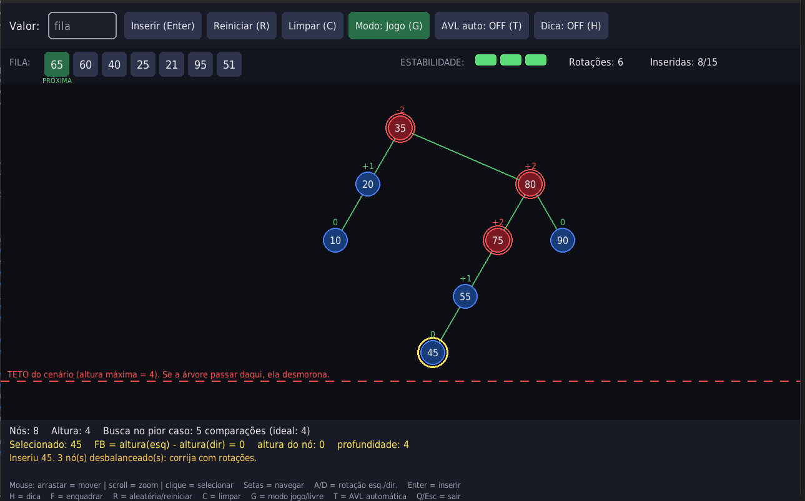
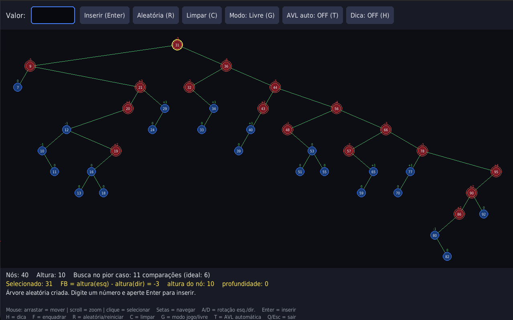

# 🌳 Jogo Didático BTREE de jrenner

Projeto desenvolvido para a disciplina de **Estruturas de Dados II**, do curso de **Ciência da Computação**, a partir do reuso e aprimoramento do projeto `graphical-binary-trees`, desenvolvido por **jrenner**.

O projeto transforma uma **Árvore Binária de Busca (ABB)** em uma experiência interativa de aprendizagem sobre **Árvores AVL**, permitindo que o estudante insira chaves, identifique situações de desbalanceamento e execute rotações para restaurar a propriedade de balanceamento da árvore.




---

## 📚 1. Contexto do Projeto

### Tema

**Design de Jogos Educativos sobre Árvores Avançadas por meio da Engenharia Reversa e Reuso de Modelos**

### Objetivo

O projeto tem como objetivo transformar conceitos teóricos de **Estruturas de Dados II**, especialmente aqueles relacionados a **Árvores AVL**, em mecânicas interativas de jogo.

A proposta parte de uma implementação existente de uma **Árvore Binária de Busca** e adiciona mecanismos de:

* cálculo do Fator de Balanceamento;
* identificação de nós críticos;
* rotações simples e duplas;
* inserção de chaves pelo jogador;
* feedback imediato;
* sistema de estabilidade;
* condição de vitória e derrota;
* comparação entre o custo ideal e o pior caso de busca.

Dessa forma, o estudante deixa de ser apenas espectador da estrutura e passa a participar diretamente de sua manutenção.

---

# 2. Identificação do Modelo Base

**Nome:** `graphical-binary-trees`

**Autor:** jrenner

**Repositório:**
https://github.com/jrenner/graphical-binary-trees

**Tecnologia:** Python / Pygame

O projeto original é um visualizador de **Árvore Binária de Busca**, permitindo visualizar uma árvore gerada automaticamente e navegar entre seus nós.

---

## 2.1 Funcionamento do Modelo Original

A implementação original:

* gera uma ABB aleatória com 100 nós;
* apresenta a árvore graficamente;
* permite navegar entre pai, filho esquerdo e filho direito;
* permite movimentar a câmera utilizando as teclas **WASD**;
* permite gerar uma nova árvore aleatória utilizando **R**;
* apresenta informações básicas do nó selecionado, como valor e profundidade.

Apesar de permitir visualizar a estrutura, o usuário possui pouca participação sobre o estado da árvore.

---

# 3. Diagnóstico do Modelo Reutilizado

## 3.1 Limitações Identificadas

A análise do modelo original permitiu identificar as seguintes limitações:

### 1. Usuário passivo

O usuário apenas observa e navega pela árvore. Não existem operações que exijam decisões relacionadas à manutenção da estrutura.

### 2. Ausência de inserção controlada

A árvore é gerada aleatoriamente. O usuário não consegue inserir uma chave específica e observar o efeito daquela inserção na estrutura.

### 3. Ausência de balanceamento

O modelo utiliza uma ABB convencional e não possui:

* Fator de Balanceamento;
* detecção de desequilíbrio;
* rotações;
* mecanismo de correção;
* consequência para árvores degeneradas.

Assim, uma sequência desfavorável de inserções pode fazer a árvore se aproximar de uma estrutura linear, degradando o custo da busca para **O(n)**.

### 4. Ausência de objetivo didático

O modelo não apresenta uma condição clara de vitória, derrota ou desempenho relacionada à qualidade estrutural da árvore.

### 5. Limitações de navegação

A movimentação da câmera é realizada pelo teclado e não havia mecanismos como zoom pelo mouse ou seleção direta dos nós.

### 6. Código originalmente desenvolvido em Python 2

A implementação original utiliza recursos de Python 2, sendo necessária adaptação para execução em versões atuais do Python.

---

# 4. Estrutura Selecionada para o Upgrade

## 🌳 Árvore AVL

A estrutura escolhida para o upgrade foi a **Árvore AVL**.

A AVL mantém a propriedade de uma Árvore Binária de Busca, mas adiciona uma restrição de balanceamento:

> Para cada nó, a diferença entre as alturas das subárvores esquerda e direita deve pertencer ao conjunto `{−1, 0, +1}`.

O **Fator de Balanceamento (FB)** utilizado no projeto é definido por:

```text
FB = altura(esquerda) − altura(direita)
```

Quando:

```text
|FB| ≤ 1
```

o nó está balanceado.

Quando:

```text
|FB| ≥ 2
```

o nó está desbalanceado e precisa ser corrigido.

---

# 5. Mapeamento dos Conceitos em Mecânicas de Gameplay

| Conceito de Estruturas de Dados | Mecânica no jogo                                                                                   |    |                      |
| ------------------------------- | -------------------------------------------------------------------------------------------------- | -- | -------------------- |
| **Nó / Chave**                  | Cada chave é representada por um círculo numerado na árvore.                                       |    |                      |
| **Árvore Binária de Busca**     | Chaves menores são posicionadas à esquerda e maiores à direita, sem duplicação.                    |    |                      |
| **Altura**                      | A altura dos nós é calculada e utilizada para determinar o Fator de Balanceamento.                 |    |                      |
| **Fator de Balanceamento**      | Exibido acima dos nós e utilizado para identificar situações de desequilíbrio.                     |    |                      |
| **Nó crítico**                  | Nó cujo `                                                                                          | FB | `atingiu`2` ou mais. |
| **Rotação**                     | Operação executada pelo jogador para corrigir o desequilíbrio.                                     |    |                      |
| **Estabilidade**                | Recurso limitado que representa a capacidade do jogador de manter a árvore em condições adequadas. |    |                      |
| **Teto de altura**              | Limite utilizado para representar a degradação da estrutura.                                       |    |                      |
| **Custo de busca**              | O custo no pior caso é apresentado em função da altura da árvore.                                  |    |                      |

---

# 6. Regras de Balanceamento

O jogo utiliza quatro situações fundamentais de desequilíbrio.

| Fator no nó crítico | Fator no filho | Caso              | Operação                                              |
| ------------------: | -------------: | ----------------- | ----------------------------------------------------- |
|                `+2` |          `≥ 0` | Esquerda-Esquerda | Rotação simples à direita                             |
|                `+2` |           `−1` | Esquerda-Direita  | Rotação à esquerda no filho + rotação à direita no nó |
|                `−2` |          `≤ 0` | Direita-Direita   | Rotação simples à esquerda                            |
|                `−2` |           `+1` | Direita-Esquerda  | Rotação à direita no filho + rotação à esquerda no nó |

Essas regras transformam diretamente o conceito teórico de balanceamento em decisões que precisam ser tomadas durante o jogo.

---

# 7. Core Loop

O ciclo principal do modo jogo é:

1. O jogador recebe a próxima chave da fila.
2. A chave é inserida na ABB utilizando as regras convencionais.
3. A árvore é redistribuída visualmente.
4. Os fatores de balanceamento são recalculados.
5. O jogador identifica o nó crítico.
6. O jogador determina qual dos quatro casos de rotação ocorreu.
7. O jogador executa a rotação correta.
8. O sistema fornece feedback sobre a ação.
9. A árvore é recalculada.
10. Quando todos os nós estiverem balanceados, uma nova chave pode ser inserida.

O processo continua até que toda a sequência de chaves seja processada.

---

# 8. Condições do Jogo

## 🏆 Vitória

O jogador vence ao:

* inserir todas as chaves da fila;
* manter a árvore válida como AVL;
* finalizar com todos os nós apresentando `|FB| ≤ 1`;
* manter a estabilidade acima de zero.

A quantidade de rotações também é utilizada como elemento de desempenho.

---

## ❌ Derrota

Existem duas condições principais de derrota.

### Estabilidade zerada

O jogador possui três pontos de estabilidade.

Inserir uma nova chave enquanto a árvore ainda estiver desbalanceada consome um ponto de estabilidade.

Ao atingir zero, o cenário é encerrado.

### Teto de altura ultrapassado

O jogo também estabelece um teto de altura baseado na altura máxima esperada para uma AVL com a quantidade atual de nós, acrescido de uma margem de tolerância.

Caso esse limite seja ultrapassado, a estrutura é considerada degradada.

A situação representa didaticamente a aproximação de uma árvore degenerada, na qual o custo da busca pode se aproximar de **O(n)**.

---

# 9. Modos de Jogo

## 🔧 Modo Livre

O Modo Livre é uma evolução direta do visualizador original.

Permite:

* gerar árvores aleatórias;
* inserir valores manualmente;
* executar rotações;
* receber dicas;
* observar os fatores de balanceamento;
* visualizar a altura da árvore.

Também existe uma opção de **AVL automática**, utilizada exclusivamente como demonstração e comparação com o resultado esperado.

A função automática permanece desligada por padrão para evitar que o jogador deixe de participar do processo de balanceamento.

---

## 🎮 Modo Jogo

O Modo Jogo transforma o processo de balanceamento em um desafio.

Possui:

* fila de chaves;
* estabilidade;
* identificação de nós críticos;
* teto de altura;
* rotações realizadas pelo jogador;
* feedback;
* condição de vitória;
* condição de derrota.

---

# 10. Melhorias de Usabilidade

Além da alteração da estrutura de dados, o projeto também recebeu melhorias de interação.

### 🖱️ Controle por mouse

* Arrastar para movimentar a área de visualização;
* Scroll para aplicar zoom;
* Clique para selecionar nós.

### ⌨️ Controles de teclado

| Tecla       | Função                             |
| ----------- | ---------------------------------- |
| `A`         | Rotação à esquerda                 |
| `D`         | Rotação à direita                  |
| `Enter`     | Inserir chave                      |
| `H`         | Exibir dica                        |
| `F`         | Enquadrar a árvore                 |
| `R`         | Gerar árvore aleatória / reiniciar |
| `C`         | Limpar árvore                      |
| `G`         | Alternar Modo Jogo / Modo Livre    |
| `T`         | Alternar AVL automática            |
| `Q` / `Esc` | Sair                               |

A navegação por teclado existente no modelo também permanece disponível para percorrer pai e filhos.

---

# 11. Distribuição Automática da Árvore

O posicionamento dos nós é recalculado automaticamente após alterações na estrutura.

A distribuição considera:

* ordem dos nós;
* profundidade;
* posição horizontal;
* posição vertical;
* mudanças causadas por inserções;
* mudanças causadas por rotações.

O objetivo é evitar sobreposição e manter a estrutura compreensível visualmente durante a execução.

---

# 12. Feedback e Elementos Educacionais

O jogo fornece feedback imediato após as ações do jogador.

Entre os feedbacks possíveis estão:

* indicação de rotação correta;
* indicação de operação incorreta;
* identificação do caso de desequilíbrio;
* indicação de que uma segunda rotação é necessária;
* dicas sobre a operação adequada.

O Fator de Balanceamento também funciona como um indicador visual do estado da árvore.

---

# 13. Comparação com o Modelo Original

| Modelo original                        | Upgrade AVL                                  |
| -------------------------------------- | -------------------------------------------- |
| ABB aleatória                          | ABB com possibilidade de inserção controlada |
| 100 nós aleatórios                     | Quantidade de nós controlada pelo projeto    |
| Navegação pelos nós                    | Navegação + interação com a estrutura        |
| Sem balanceamento                      | Fator de Balanceamento                       |
| Sem rotações                           | Rotações simples e duplas                    |
| Sem objetivo de jogo                   | Modo Livre + Modo Jogo                       |
| Sem condição de derrota                | Estabilidade e teto de altura                |
| Sem feedback sobre qualidade da árvore | Feedback e dicas                             |
| Câmera controlada por WASD             | Mouse + zoom                                 |
| Layout calculado inicialmente          | Layout recalculado após alterações           |
| Nós representados como caixas          | Nós representados como círculos              |
| Python 2                               | Python 3                                     |

---

# 14. Alterações Realizadas no Código Original

O arquivo `btree_Original.py`, baseado no projeto original, recebeu adaptações para permitir sua execução em Python 3.

Entre os ajustes realizados estão:

* substituição de `print "texto"` por `print("texto")`;
* substituição de divisões `/` por `//` quando a intenção era obter divisão inteira;
* correção do tratamento do valor `0` como nó válido;
* alteração da geração da raiz para evitar duplicidade;
* inclusão do bloco:

```python
if __name__ == "__main__":
```

Essas alterações foram realizadas para compatibilidade e correção de execução, mantendo o comportamento original sempre que possível.

---

# 15. O que foi Mantido do Modelo Base

O upgrade preserva características fundamentais do projeto original:

* representação de uma ABB;
* regra de posicionamento menor à esquerda e maior à direita;
* ausência de valores duplicados;
* navegação entre pai e filhos;
* seleção de nós;
* exibição do valor do nó;
* exibição da profundidade;
* geração de árvores aleatórias.

A partir dessa base, foram incorporadas as mecânicas específicas da AVL.

---

# 16. O que foi Acrescentado

O projeto adiciona funcionalidades que não estavam presentes no modelo original:

* inserção manual de chaves;
* Fator de Balanceamento;
* cálculo de altura;
* identificação de nós críticos;
* rotações simples;
* rotações duplas;
* classificação dos quatro casos de rotação;
* feedback após as operações;
* sistema de dicas;
* custo de busca no pior caso;
* comparação com o custo ideal;
* sistema de estabilidade;
* teto de altura;
* Modo Jogo;
* condições de vitória e derrota;
* distribuição automática da árvore;
* zoom;
* seleção por mouse;
* AVL automática para demonstração.

---

# 17. Arquivos do Projeto

| Arquivo                  | Descrição                                                                    |
| ------------------------ | ---------------------------------------------------------------------------- |
| `btree_Original.py`               | Código baseado na implementação original de jrenner, adaptado para Python 3. |
| `btree_update.py`           | Implementação do upgrade, contendo a estrutura AVL e o Modo Jogo.            |
| `README.md` | Documento de especificação e planejamento do projeto.                        |

---

# 18. Como Executar

## Requisitos

* **Python 3**
* **Pygame**

Instalação do Pygame:

```bash
pip install pygame
```

## Execução

Execute:

```bash
python btree_update.py
```

Após iniciar, utilize o mouse e o teclado para interagir com a árvore.

## OU

Execute:

```bash
mkdir ~/arvore
mv ~/Downloads/btree_update.py ~/arvore/
cd ~/arvore
python btree_update.py
```


---


# 19. Integrante

### Aluno: Isaque Kirmse Mendonça Soares
### Disciplina: Estruturas de Dados II 
### Curso: Ciência da Computação 
### Data: 29/09/2026

---

# 20. Créditos

### Modelo Base

**jrenner — `graphical-binary-trees`**

https://github.com/jrenner/graphical-binary-trees

A proposta original de visualização de uma Árvore Binária de Busca e o código do projeto base são de jrenner. Este projeto reutiliza essa base e a amplia com funcionalidades voltadas ao ensino de Árvores AVL.

---

# 22. Referências

* JRENNER. *graphical-binary-trees*. GitHub. https://github.com/jrenner/graphical-binary-trees
* CELES, W.; RANGEL, J. L. *Árvores*. Estruturas de Dados — PUC-Rio.
* Material das aulas de **Estruturas de Dados II**.
